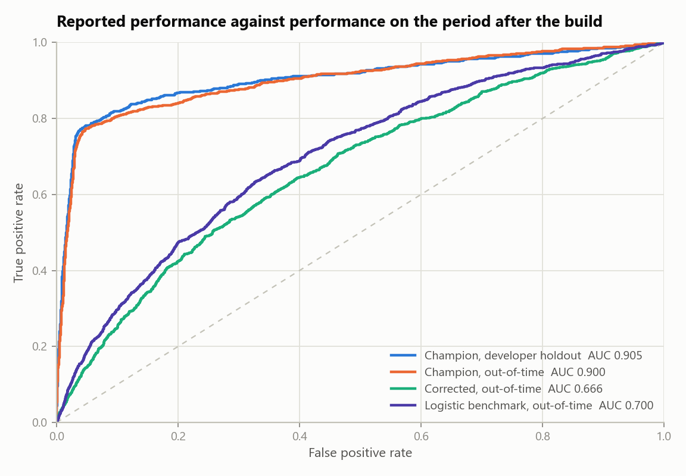
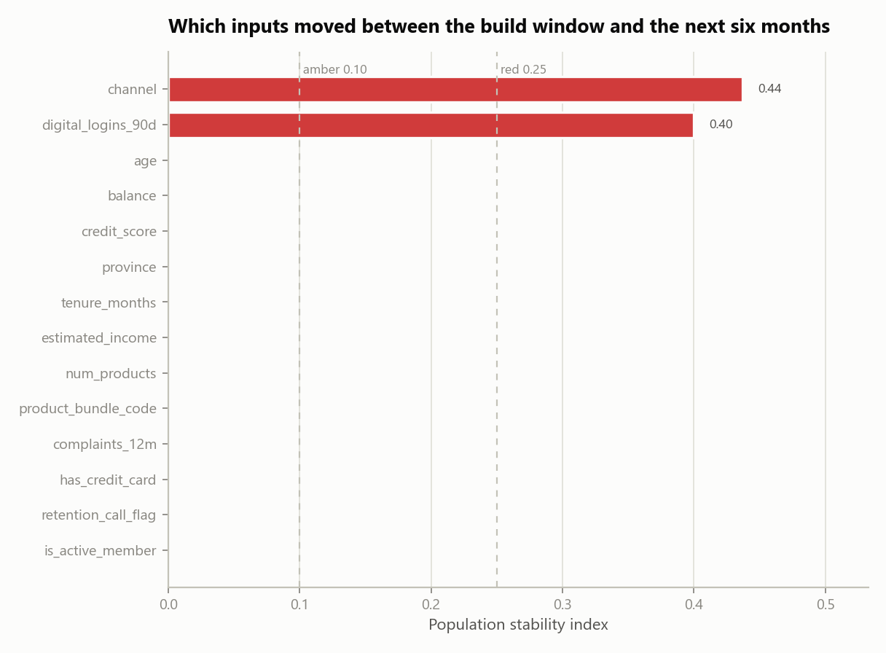

# bank-churn-model-validation

[](https://github.com/NiliRahmani/bank-churn-model-validation/actions/workflows/tests.yml)

**An independent validation of a retail-banking churn model — the review, not the model.**

Most churn projects build a model and report how well it scores. This one does
the other job: a bank has a churn model in production, it is due for periodic
validation, and someone independent has to decide whether it can keep running.
The repository contains the developer's submission, the tests I ran against it,
and the signed validation report that came out the other end.

The answer was no.

> The work sits on the model risk side rather than the modelling side. Its
> deliverable is a **report and a findings register**, not a leaderboard — the
> output of a validation function is a decision, with reasons a committee can be
> held to.

---

## The result

> **The submission reports AUC 0.905. The model that would actually run in
> production scores 0.666, and is beaten by the eight-variable logistic
> regression used as its own benchmark (0.700).**
>
> Eight findings: **2 High, 5 Medium, 1 Low**. Outcome: **not approved for use**.

📄 **The report:** [`assets/Model_Validation_Report.pdf`](assets/Model_Validation_Report.pdf)
— 8 pages, the deliverable this repository exists to produce.
Also readable as [`results/model_validation_report.md`](results/model_validation_report.md).

| model | sample | AUC | Gini | KS | calibration error | lift @ top 20% |
|---|---|---|---|---|---|---|
| Champion as submitted | developer's random holdout | **0.905** | 0.809 | 0.734 | 0.078 | 4.19 |
| Champion as submitted | out-of-time | 0.900 | 0.799 | 0.725 | 0.062 | 4.00 |
| Champion, post-outcome variable removed | out-of-time | **0.666** | 0.332 | 0.248 | 0.202 | 1.88 |
| Logistic benchmark (8 variables) | out-of-time | **0.700** | 0.401 | 0.307 | 0.052 | 2.03 |



*Almost the entire gap is one variable. `retention_call_flag` is written to the
customer record when the retention team logs a call — and they call customers
who have already given notice. It is a record of the outcome, and it will be
empty at the moment a score is needed.*



*Two inputs moved by more than four times the red threshold within six months of
the build. The score distribution did not (PSI 0.02), so a monitoring process
watching the score alone would have reported this model as stable throughout.*

*(Everything regenerates with `python run.py`; the PDF with `python scripts/make_report_pdf.py`.)*

## The findings

| ref | severity | finding |
|---|---|---|
| VF-01 | High | Model uses a variable only known after the outcome it predicts |
| VF-02 | High | Champion is outperformed out-of-time by a logistic benchmark |
| VF-03 | Medium | Predicted probabilities inflated 3.3x by the class balancing step |
| VF-04 | Medium | Input extract fails 7 of 8 data quality rules, unmentioned in the submission |
| VF-05 | Medium | Input population shifted materially within six months of the build |
| VF-06 | Medium | Age band selection rate fails the four-fifths test, through a bundle code that restates age |
| VF-07 | Medium | Only performance evidence is a random split, which cannot detect that shift |
| VF-08 | Low | Development document missing three sections the standard requires |

Severity is assigned by a fixed rule, not by judgement: **High** means the model
cannot be used as submitted, **Medium** means it can run with a named
compensating control, **Low** means close it before the next review. One open
High finding is what produces "not approved" — the outcome falls out of the
register rather than being decided separately.

## What the review actually does

1. **Data quality assessment** of the raw extract against six dimensions —
   uniqueness, completeness, validity, consistency, accuracy, timeliness. Seven
   of eight rules fail, including 1.5% duplicated customers and 12% of balances
   where `0` stands in for a value that was never supplied.
2. **Documentation completeness** — the development document is checked against
   the nine sections the standard requires. Three are missing.
3. **Replication** — the model is rebuilt from sections 3 and 4 of the
   submission and scored on the developer's own split. It replicates, and the
   report says so; the recipe is complete enough for a third party to reproduce.
4. **Variable review** — every input is scored on its own against the outcome.
   `retention_call_flag` reaches 0.872 when nothing else passes 0.627, and that
   gap is what triggers the timing challenge.
5. **Out-of-time performance** — the model is tested on the six months after the
   build window, which the submission never did.
6. **Calibration** — predicted against observed rate by band. Mean predicted
   probability is 32.9% against an observed 10.0%. AUC cannot see this, which is
   why a submission reporting only AUC never would either.
7. **Population stability** — PSI on every input, with bin edges taken from the
   development sample only.
8. **Benchmark comparison** — a transparent logistic regression on the same
   data, to establish how much of the champion's performance comes from its
   model class.
9. **Selection rate testing** — who the campaign contacts, by age band and
   province, against the four-fifths screen.

## The bit that makes it checkable

A validation project has an obvious weakness as evidence: anyone can find
problems in a model if they also chose the problems. So the portfolio is
generated, **six defects are planted in it deliberately, and the list is
published** in [`docs/planted_defects.md`](docs/planted_defects.md) alongside the
test that catches each one. `tests/test_smoke.py` asserts every one of those
links, so a defect that stops being caught fails the suite.

Two findings were not planted. One is a genuine discovery — the class balancing
step inflates the probabilities, which follows from the developer's recipe and
would happen the same way on real data. The other, VF-02, comes with a caveat I
would rather state than bury: the generator draws churn from a linear log-odds
model, so the logistic benchmark is close to the true functional form by
construction and is advantaged in that comparison. The finding stands for this
model on this period, and the real point survives either way — the submission
never ran the benchmark at all.

## Quickstart

```bash
python -m venv .venv && source .venv/bin/activate     # Windows: .venv\Scripts\activate
pip install -r requirements.txt

python run.py                        # full review: results/, assets/, the report
python run.py --quick                # smaller portfolio, fast check
python run.py --seed 7               # re-run the whole review on a different draw
python scripts/make_report_pdf.py    # render the report to PDF
pytest -q                            # 15 tests, one per planted defect and control
```

The full review runs in about 20 seconds on a laptop. No API keys, no network access, no
downloads — `config.yaml` holds the seed and every threshold, and the portfolio
is built from it.

## Project layout

```
modelval/
  portfolio.py       # the generated bank portfolio, defects included
  champion.py        # the model under review, rebuilt from the developer's document
  metrics.py         # AUC, Gini, KS, PSI, calibration error, lift
  quality.py         # data quality rules across the six dimensions
  documentation.py   # required-section check on the submission
  performance.py     # replication, variable timing review, out-of-time, calibration
  stability.py       # PSI by input and on the score
  fairness.py        # selection rate, four-fifths, proxy strength
  findings.py        # the findings register and the severity rule
  report.py          # one block list rendered to both Markdown and HTML
  plots.py           # the four report figures
developer/           # the submission being reviewed
docs/                # planted defect list, walkthrough
run.py               # end-to-end
tests/               # one test per planted defect
```

## Design choices worth noting

- **The report is generated, not written.** Every number in it comes from the
  code, so it cannot drift out of step with the results. `report.py` builds one
  ordered block list and renders it to both Markdown and HTML.
- **Findings are raised by tests, not by narrative.** Each module returns its
  results *and* any finding they trigger, against a threshold in `config.yaml`.
  Change the threshold and the register changes with it.
- **Two effects are never measured through each other.** Calibration and the
  split-design finding are both assessed on the corrected model, because
  measuring them on the model as submitted would credit them with an inflation
  that belongs to VF-01.
- **Uneven outcomes and encoded proxies are kept apart.** Age bands genuinely
  differ in churn risk, and that alone is not a finding. That the model reaches
  the difference through a product code identifying over-60s at 0.947 AUC, while
  the submission states no protected characteristic is used, is.
- **The report argues against itself.** Section 13 lists six limitations,
  including the one that weakens its own second-highest finding.

## About the data

The portfolio is synthetic and is generated by `modelval/portfolio.py` from the
seed in `config.yaml`. No customer data, licensed dataset or credential is
involved, and nothing is downloaded at runtime. The tests, thresholds and
reasoning are the transferable part of this repository; the magnitudes are
illustrative and are described that way in the report.

## References

- Board of Governors of the Federal Reserve System / OCC, *Supervisory Guidance
  on Model Risk Management* (SR 11-7 / OCC 2011-12) — conceptual soundness,
  ongoing monitoring and outcomes analysis as the three legs of validation, and
  effective challenge as the standard for independence.
- Office of the Superintendent of Financial Institutions, *Guideline E-23,
  Model Risk Management* — the Canadian framework this report's structure and
  approval language follow.
- *Uniform Guidelines on Employee Selection Procedures*, 29 CFR Part 1607 — the
  origin of the four-fifths rule, used here as a screening threshold rather than
  a legal test.
- Siddiqi, *Credit Risk Scorecards* — population stability index and the
  0.10 / 0.25 convention.
