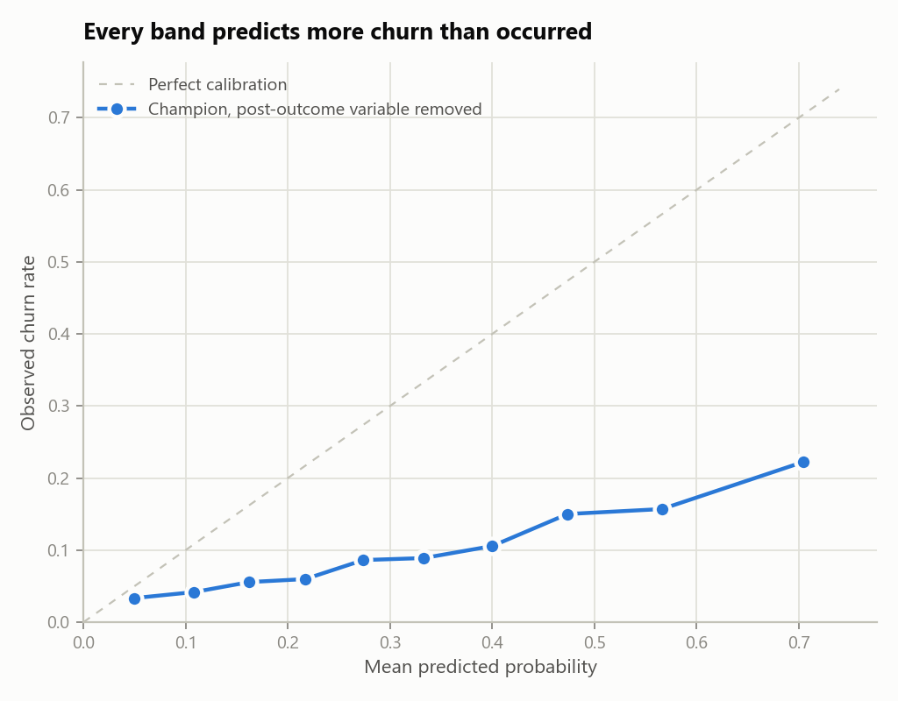
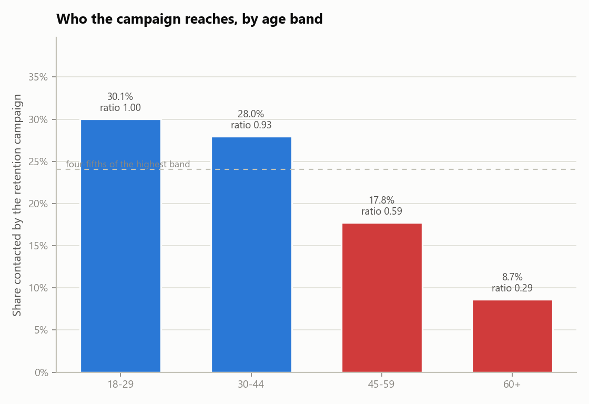

# Model Validation Report

*Retail Banking Attrition Propensity Model (RB-CHURN-07), version 2.1  |  Independent validation  |  Review date 2024-09-30  |  Reviewer: Niloufar Rahmani*

## 1. Conclusion

> Outcome: Not approved for use. 2 High, 5 Medium and 1 Low findings are raised. Nothing in this report turns on a judgement call: each finding is a measurement the developer could have taken before submitting.

The submission reports an AUC of 0.905. That figure is real: rebuilding the model from the recipe in the submission reproduces it exactly, seed included. It is not, however, a measure of what the model does in production. One of its fourteen inputs is written to the customer record after the customer has already given notice of leaving, so it will be empty at the moment a score is needed. Removing it and testing on the six months following the build window gives an AUC of 0.666 — 48 Gini points below the figure the business case rests on.

At that level the model is beaten by its own benchmark. A logistic regression on 8 variables, fitted on the same data, scores 0.700 on the same out-of-time sample against the champion's 0.666. The submission justifies the gradient-boosted model class on predictive power, and out-of-time it does not have any to justify it with. Those two results are the High findings. The model is not approved for use in its current form; section 14 sets out what would change that.

## 2. Scope and approach

This review covers the model as submitted for its scheduled periodic validation: the development sample (2023-01-01 to 2023-12-31), the out-of-time sample (2024-01-01 to 2024-06-30), the development document, and the fitted model rebuilt from that document. It does not cover the production scoring code, the campaign management system the scores are consumed by, or the vendor data feeds behind two of the inputs.

Testing was carried out independently rather than by re-reading the developer's own analysis. Every number in this report was produced by code in this repository from the raw extract, and every test is one the developer could have run before submitting.

- Data quality assessment of the extract, against the bank's six data quality dimensions
- Completeness check of the development document against the required sections
- Replication of the reported result from the documented recipe
- Variable review, including whether each input is knowable at scoring time
- Performance testing on an out-of-time sample the model did not see
- Calibration of predicted probabilities against observed outcomes
- Population stability of every input, and of the score itself
- Comparison against a transparent benchmark model
- Selection rate testing across age band and province

## 3. Data quality assessment

The extract was tested before any modelling work. Rules are applied to the raw file as received, so the results describe what the developer was working with rather than what it becomes after treatment.

| dimension | rule | records failed | share failed | outcome | note |
|---|---|---|---|---|---|
| Uniqueness | customer_id appears once per observation window | 480 | 0.0148 | Fail | Extract was appended twice for part of the load. |
| Completeness | age is populated | 68 | 0.0021 | Fail | Age written as 0 where the value was not captured. |
| Completeness | credit_score is populated | 355 | 0.0109 | Fail | Two sentinel conventions in use: 999 and -1. |
| Validity | credit_score falls within 300-900 | 355 | 0.0109 | Fail | Same records as the sentinel values above. |
| Validity | province uses the two-letter standard | 879 | 0.0271 | Fail | Long-form names and lower case arriving from upstream systems. |
| Consistency | province has at most 6 distinct values | 15 | 0.0005 | Fail | 21 distinct values observed for 6 real provinces. |
| Accuracy | balance distinguishes a nil balance from a missing one | 3892 | 0.1198 | Fail | Zero is being used for both, which an average cannot tell apart. |
| Timeliness | development sample is under 12 months old at review | 0 | 0.0 | Pass | Development window closed 9 months before this review. |

Failures were remediated in this review before the modelling tests, so that the champion, the benchmark and the corrected refits are all compared on the same treated data. The treatment applied was: de-duplicate on customer identifier, translate both credit score sentinels to a null plus an explicit missing indicator, separate an unsupplied balance from a nil one, and standardise province codes. None of this treatment is described in the submission.

## 4. Documentation completeness

| required section | present |
|---|---|
| Purpose and intended use | Yes |
| Data sources and lineage | Yes |
| Variable selection | Yes |
| Model methodology | Yes |
| Performance testing | Yes |
| Assumptions and limitations | No |
| Ongoing monitoring plan | No |
| Benchmark comparison | No |
| Implementation and controls | Yes |

## 5. Replication

The model was rebuilt from sections 3 and 4 of the development document, using the developer's split, class balancing and hyperparameters, and scored on their own held-out sample.

| reported auc | replicated auc | absolute difference | tolerance | outcome |
|---|---|---|---|---|
| 0.9046 | 0.9046 | 0.0 | 0.01 | Replicated |

The result replicates. This is a genuine strength of the submission and it is recorded as such: the recipe in the document is complete enough for a third party to reproduce the model, which is not always the case. Everything that follows is about what the reported number measures, not about whether it is real.

## 6. Variable review

Each input was scored on its own against the outcome. The test is deliberately blunt: a single variable that separates churners from non-churners almost perfectly is either the most valuable field the bank owns, or it is not available at the time the model runs.

| variable | standalone auc | flagged |
|---|---|---|
| retention_call_flag | 0.8718 | Yes |
| is_active_member | 0.6265 | No |
| tenure_months | 0.5908 | No |
| complaints_12m | 0.5743 | No |
| age | 0.5729 | No |
| credit_score | 0.5648 | No |
| num_products | 0.5553 | No |
| channel | 0.5439 | No |
| digital_logins_90d | 0.5407 | No |
| product_bundle_code | 0.538 | No |
| estimated_income | 0.5287 | No |
| has_credit_card | 0.5255 | No |
| province | 0.5139 | No |
| balance | 0.5078 | No |

The strongest input reaches 0.872 on its own, against 0.626 for the strongest of the remaining thirteen. The data dictionary records it as written when a retention call is logged, and retention calls are placed after a customer has given notice. It is a record of the outcome, not a predictor of it, and it cannot be populated at the moment a score is needed. This is finding VF-01.

## 7. Performance testing

Four states of the model are compared on the same footing: as submitted on the developer's random holdout, as submitted on the following six months, refit without the post-outcome variable, and a transparent benchmark.

| model | sample | customers | churn rate | auc | gini | ks | calibration error | lift top 20pct |
|---|---|---|---|---|---|---|---|---|
| Champion as submitted | Developer random holdout | 7200 | 0.1 | 0.9046 | 0.8092 | 0.734 | 0.0779 | 4.188 |
| Champion as submitted | Out-of-time | 8000 | 0.1522 | 0.8997 | 0.7993 | 0.725 | 0.0617 | 4.002 |
| Champion without post-outcome variable | Out-of-time | 8000 | 0.1522 | 0.6661 | 0.3322 | 0.2476 | 0.2023 | 1.884 |
| Logistic benchmark (8 variables) | Out-of-time | 8000 | 0.1522 | 0.7004 | 0.4008 | 0.307 | 0.0521 | 2.028 |

*The gap between the submitted result and out-of-time performance, before and after the post-outcome variable is removed.*

The two causes are worth separating, because they do not carry equal weight. Moving the model as submitted from the random holdout to the out-of-time sample costs almost nothing (0.905 to 0.900), since the post-outcome variable is present in both. Removing that variable on the same out-of-time sample costs 0.234. Practically all of the gap is one variable, and the later period accounts for 0.010 of it once the variable is out of the way.

## 8. Calibration

The model's output is used as a probability, so it was tested as one: customers were banded by predicted probability and the predicted rate compared against what actually happened in each band.

This test is run on the model with the post-outcome variable removed. On the model as submitted that variable pushes almost every score to one extreme or the other, which conceals this problem rather than fixing it, and the corrected model is in any case the only version that could be deployed.

| band | customers | predicted | observed | gap |
|---|---|---|---|---|
| (0.00309, 0.0804] | 720 | 0.0495 | 0.0333 | 0.0162 |
| (0.0804, 0.135] | 720 | 0.1083 | 0.0417 | 0.0666 |
| (0.135, 0.19] | 720 | 0.1624 | 0.0556 | 0.1069 |
| (0.19, 0.245] | 720 | 0.217 | 0.0597 | 0.1573 |
| (0.245, 0.302] | 720 | 0.2738 | 0.0861 | 0.1877 |
| (0.302, 0.365] | 720 | 0.333 | 0.0889 | 0.2441 |
| (0.365, 0.433] | 720 | 0.4001 | 0.1056 | 0.2946 |
| (0.433, 0.517] | 720 | 0.4737 | 0.15 | 0.3237 |
| (0.517, 0.62] | 720 | 0.5661 | 0.1569 | 0.4092 |
| (0.62, 0.892] | 720 | 0.7043 | 0.2222 | 0.482 |

*Predicted against observed churn rate by band. Every band sits below the diagonal, so every band over-predicts.*

Mean predicted probability is 32.9% against an observed rate of 10.0%. The cause is in the developer's own recipe: the minority class was oversampled to a level base rate and the output was never mapped back. The ranking is unaffected, which is why the AUC does not show it, but any calculation that multiplies these probabilities by a dollar amount is overstated by roughly the same factor. This is finding VF-03.

## 9. Population stability

Stability was measured between the development window and the following six months, with bin edges taken from the development sample only.

| variable | type | psi | band |
|---|---|---|---|
| channel | categorical | 0.4367 | Red |
| digital_logins_90d | numeric | 0.3995 | Red |
| age | numeric | 0.0017 | Green |
| balance | numeric | 0.0016 | Green |
| credit_score | numeric | 0.0015 | Green |
| province | categorical | 0.0014 | Green |
| estimated_income | numeric | 0.0012 | Green |
| tenure_months | numeric | 0.0012 | Green |
| num_products | numeric | 0.0002 | Green |
| product_bundle_code | categorical | 0.0002 | Green |
| complaints_12m | numeric | 0.0001 | Green |
| has_credit_card | numeric | 0.0 | Green |
| is_active_member | numeric | 0.0 | Green |
| retention_call_flag | numeric | 0.0 | Green |

*Population stability index by input, against the 0.10 amber and 0.25 red thresholds.*

The movement is a channel migration rather than a data fault: customers moved to mobile and their engagement counts moved with them. The score distribution is the part worth dwelling on. At PSI 0.02 it sits (green) well inside the acceptable band, so a monitoring process that watched the score alone would have reported this model as stable throughout, while two of its inputs moved by more than four times the red threshold. Score-level monitoring is the common choice because it is the cheapest, and this is the case it misses. This is finding VF-05.

## 10. Benchmark comparison

A logistic regression on 8 variables, fitted on the same treated development sample and scored on the same out-of-time sample, is used as the benchmark. It is not proposed as a replacement; it is there to establish how much of the champion's performance is attributable to its model class.

Corrected champion 0.666 against benchmark 0.700. The benchmark is ahead by 0.034 AUC, so the comparison does not end in a question about whether the extra complexity is worth carrying — it ends with the simpler model being more accurate on the period that matters. The champion's hyperparameters were selected against the random split, which is the ordinary way this outcome arises: the additional flexibility fitted the development window rather than the underlying relationship. This is finding VF-02.

## 11. Selection rate testing

The score decides who a retention campaign contacts, so the outcome that matters to a customer is whether they fall inside the top 20% the campaign can afford to reach. Selection rate was tested across age band and province.

| age band | customers | selected | observed churn | selection rate | impact ratio | meets four fifths |
|---|---|---|---|---|---|---|
| 18-29 | 469 | 141 | 0.2175 | 0.3006 | 1.0 | Yes |
| 30-44 | 2878 | 806 | 0.1744 | 0.2801 | 0.9315 | Yes |
| 45-59 | 2739 | 487 | 0.1431 | 0.1778 | 0.5914 | No |
| 60+ | 1914 | 166 | 0.116 | 0.0867 | 0.2885 | No |

*Share of each age band contacted, against four-fifths of the highest band.*

| province | customers | selected | observed churn | selection rate | impact ratio | meets four fifths |
|---|---|---|---|---|---|---|
| AB | 1034 | 227 | 0.1528 | 0.2195 | 1.0 | Yes |
| BC | 1219 | 214 | 0.1436 | 0.1756 | 0.7997 | No |
| MB | 438 | 90 | 0.1689 | 0.2055 | 0.936 | Yes |
| NS | 372 | 71 | 0.1532 | 0.1909 | 0.8694 | Yes |
| ON | 3116 | 682 | 0.1508 | 0.2189 | 0.997 | Yes |
| QC | 1821 | 316 | 0.156 | 0.1735 | 0.7904 | No |

Two separate questions are involved and the distinction matters. The first is whether the selection rate is uneven, and it is. Part of that is legitimate: the observed churn column shows the bands genuinely differ. The second is whether the model is reading a protected characteristic through another field, and it is. Product bundle code alone identifies customers aged 60 and over with an AUC of 0.947, so removing age from the feature list would not have changed the outcome, and the submission's statement that no protected characteristic is used is not accurate. Refitting without the bundle code costs 0.002 AUC. This is finding VF-06.

## 12. Findings register

| ref | severity | area | finding | observation | implication | recommendation |
|---|---|---|---|---|---|---|
| VF-01 | High | Conceptual soundness | Model uses a variable that is only known after the outcome it predicts | retention_call_flag reaches a standalone AUC of 0.872 against a portfolio in which no other variable exceeds 0.626. The data dictionary records it as being written when a retention call is logged, and retention calls are placed after a customer has given notice of leaving. Flagged variables: retention_call_flag. | The variable will be absent, or will be zero for everyone, at the moment the model is actually scored. Every performance figure in the submission is therefore an overstatement of what the model can do in production, and the size of the overstatement is not disclosed. | Remove the variable, refit, and restate all reported performance. Add a point-in-time availability check to the development standard so the timing of every candidate variable is evidenced before it is used. |
| VF-02 | High | Model selection | Champion is outperformed out-of-time by a logistic benchmark | On the out-of-time sample the corrected gradient-boosted model scores AUC 0.666 against 0.700 for a 8-variable logistic regression fitted on the same data, a difference of -0.034 against a parity margin of 0.020. | The submission justifies the model class on predictive power. Out-of-time it does not have any: the bank is carrying the monitoring, explainability and refit burden of a gradient-boosted model in exchange for 0.034 AUC less accuracy than a regression it could put in a spreadsheet. Tuning was carried out against the random split, which is the pattern that produces exactly this result — the extra flexibility fitted the development period rather than the signal. | Adopt the benchmark as the production model, or resubmit the gradient-boosted model with its hyperparameters selected against an out-of-time sample and with evidence that it beats the benchmark there. Either way the benchmark comparison belongs in the submission rather than in the review. |
| VF-03 | Medium | Calibration | Predicted probabilities are inflated by the class balancing step | Measured with the post-outcome variable removed, average predicted churn probability is 32.9% against an observed rate of 10.0%, a factor of 3.3. Weighted calibration error across ten bands is 0.229, and every band over-predicts. | The minority class was oversampled to a 50/50 base rate and the output was never mapped back, so the model's probabilities are relative scores presented as absolute ones. Any calculation that multiplies them by a dollar value — expected loss of balance, retention campaign business case, provisioning input — is overstated by roughly the same factor. | Either drop the oversampling and use class weights, or keep it and fit a calibration mapping on an untouched holdout. Restrict the current version to ranking use only until one of the two is in place, and say so on the model's approved-use record. |
| VF-04 | Medium | Data quality | Input extract fails data quality rules that the submission does not mention | 7 of 8 rules fail, across Accuracy, Completeness, Consistency, Uniqueness, Validity. 480 records (1.5%) are duplicated on customer_id and 3,892 records (12.0%) carry a balance of zero that stands in for a value that was never supplied. | Duplicated customers are counted twice in the training data and are over-weighted by the fit. Averaging a balance field that encodes 'not supplied' as zero understates average balance across the portfolio, which affects both the model input and the reporting built on the same extract. | De-duplicate on customer_id at the point of extraction, replace both credit score sentinels with a null and an explicit missing indicator, and separate a nil balance from an unsupplied one before the next refit. Document the treatment in the model development document. |
| VF-05 | Medium | Stability | Input population has shifted materially within six months of the build | 2 of 14 model inputs breach the red threshold of 0.25 on the six months following the development window: channel (PSI 0.44), digital_logins_90d (PSI 0.40). A further 0 sit in the amber band. The model score itself has a PSI of 0.02 (Green). | The shift is a channel migration, not a data error — customers moved to mobile and their engagement counts moved with them. The model was fitted on a branch-weighted portfolio and is being applied to a mobile-weighted one. The score distribution is the part worth noting: at PSI 0.02 it sits well inside the green band, so a monitoring process watching the score alone would report this model as stable while two of its inputs moved by more than four times the red threshold. The submission contains no monitoring plan of either kind. | Put monthly PSI monitoring in place on every input, not only on the score, using the same 0.10/0.25 thresholds. Tie a red breach to a mandatory review, and shorten the refit cycle for this model to match the rate at which the channel mix is moving. |
| VF-06 | Medium | Fairness | Age band selection rate fails the four-fifths test, through a bundle code that restates age | At the top 20% campaign cut, customers in the 60+ band are selected at 8.7% against 30.1% for the highest band, an impact ratio of 0.29. Separately, product_bundle_code alone identifies customers aged 60 and over with an AUC of 0.947, so age band is available to the model whether or not age is used directly. | Part of the gap reflects a real difference in churn risk, and the observed churn column supports that. The problem is not the gap on its own but that the model reaches it through a near-perfect stand-in for a protected ground, so removing age from the feature list would not have changed the outcome and the submission's statement that no protected characteristic is used is not accurate. A retention offer is a benefit, so the group being under-selected is being withheld from. | Refit without product_bundle_code and report the performance cost. If the field is retained, record the business justification, disclose the proxy relationship in the model documentation, and add selection rate by age band to the monthly monitoring pack. |
| VF-07 | Medium | Performance testing | Only performance evidence is a random split, which cannot detect a population shift | The submission's sole performance evidence is a random 30% holdout drawn from the same twelve months as the training data. Holding the post-outcome variable out of both, the random holdout gives AUC 0.676 against 0.666 on the following six months, an inflation of 0.010. | The inflation itself is small. The design problem is not: a random split draws its test customers from the same period as its training customers, so it cannot detect population movement by construction. 2 inputs breach the red stability threshold over the six months following the build (section 9), and no test in the submission was capable of showing that. | Make an out-of-time holdout the primary performance evidence for this model class and keep the random split as a secondary diagnostic. Restate the business case on the out-of-time figure. |
| VF-08 | Low | Documentation | Development document is missing sections the standard requires | 3 of 9 required sections are absent: Assumptions and limitations; Ongoing monitoring plan; Benchmark comparison. | Without a stated limitations section there is no record of where the developer already knows the model should not be used, and without a monitoring plan there is no agreed trigger for the next review. Both gaps put the whole burden of catching deterioration on the annual validation cycle, which is too slow for a model whose inputs move within six months. | Complete the missing sections before resubmission, and add the section checklist to the intake gate so an incomplete submission is returned before review effort is spent on it. |

## 13. Limitations of this review

These bound what the conclusion above can be taken to mean.

- The portfolio is generated rather than drawn from the bank's systems, so the magnitudes are illustrative. The tests, thresholds and the reasoning are the transferable part; the numbers are not.
- Production scoring code was not reviewed, so this report cannot say whether the fitted model and the deployed model agree.
- Only age band and province were available for selection rate testing. The bank does not collect other protected characteristics, so no statement is made about grounds that were not testable.
- Outcomes were observed over a six-month horizon. A customer who leaves in month seven is counted as retained throughout.
- The benchmark is one logistic regression on one variable list, and the generated portfolio draws churn from a linear log-odds model. The benchmark is therefore close to the true functional form by construction and is advantaged in this comparison. VF-02 stands as a statement about this model on this period, and about the absence of any benchmark in the submission. It is not evidence about model classes in general.
- Every result comes from a single seed. Sampling variation across seeds was not quantified and would change the third decimal place.

## 14. Conditions for approval

The model is not approved for use in its current form. The following would change that, in the order they should be addressed.

- VF-01 must be closed before any use. Remove the post-outcome variable, refit, and restate every performance figure in the submission. Until that is done the submission describes a model the bank cannot run.
- VF-02 must be closed before any use. Either adopt the benchmark, or resubmit the gradient-boosted model with its hyperparameters selected against an out-of-time sample and evidence that it beats the benchmark there. A model that is less accurate than its own benchmark has no remaining justification for the burden it carries.
- VF-03, VF-05, VF-06 and VF-07 may be carried with named compensating controls: restrict the model to ranking use until a calibration mapping is fitted, start monthly stability monitoring on every input rather than on the score alone, either drop the bundle code or record a justification and monitor selection rate by age band, and make an out-of-time sample the primary performance evidence.
- VF-04 and VF-08 should be closed before the next scheduled review and do not block use on their own.
- A resubmission should include the out-of-time result as the headline figure, the benchmark comparison, and the monitoring plan, so that the next review starts from evidence rather than from reconstruction.
